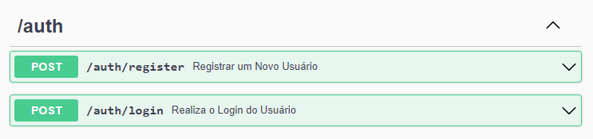
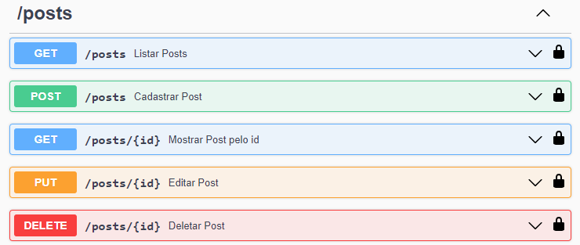
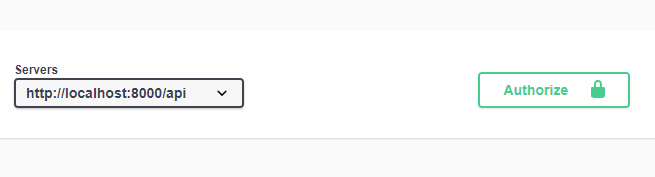

# Libertfly Challenge API

## 💻 Sobre o projeto

O projecto contém uma Api RESTFul desenvolvida em PHP com o framework Laravel,

## ⚠️ Requisitos do Projeto

-   Laravel 10
-   PHP ^8.1
-   MySQL ^5.6
-   Composer ^2.5

## 🧰 Ferramenta para Teste de Requisições HTTP

-   Swagger com a biblioteca L5 Swagger

## 🏗️ Instalação

### Clone o repositório para o seu computador e acesse a pasta do projeto:

```sh
//clone
git clone https://github.com/mariolucasdev/liberfly-challenge-api.git

//acesso a pasta
cd liberfly-challenge-api
```

### Renomeie o arquivo .env.example para .env na raiz do projeto e configure seu banco de dados:

Crie um bando de dados, para menos configurações nomeie seu banco de dados como _liberfly_challenge_api_ e conclua as configurações do seu .env.

```sh
DB_CONNECTION=mysql
DB_HOST=127.0.0.1
DB_PORT=3306
DB_DATABASE=liberfly_challenge_api //nome do seu banco de dados
DB_USERNAME=root
DB_PASSWORD=
```

### Instale as dependências do composer:

```sh
composer install
ou
composer install -q --no-ansi --no-interaction --no-scripts --no-progress --prefer-dist
```

### Gere sua chave da aplicação:

```sh
php artisan key:generate
```

### Execute as migrações do banco de dados:

```sh
php artisan migrate
```

### Execute o servidor:

```sh
php artisan serve
```

Seguido todo os passos agora você conseguirá acessar os recursos da api, através dos enpoints abaixo.

## Api Endoints

## **Autenticação**



| Método | Endpoint      | Parâmetros            | Descrição                   | Status     |
| ------ | ------------- | --------------------- | --------------------------- | ---------- |
| `POST` | auth/register | name, email, password | Cadastra um novo usuário.   | 201 ou 422 |
| `POST` | auth/login    | email, password       | Realiza o login do usuário. | 200 ou 401 |

## **Posts**



| Método   | Endpoint  | Parâmetros                    | Descrição                            | Status               |
| -------- | --------- | ----------------------------- | ------------------------------------ | -------------------- |
| `POST`   | posts     | title, slug, content, user_id | Cadastra um novo post                | 201, 401 ou 422      |
| `GET`    | posts     | ------                        | Listagem de posts do usuário logado. | 200 ou 401           |
| `GET`    | posts/:id | ------                        | Exibe 1 post pelo seu id.            | 200, 401 ou 404      |
| `PUT`    | posts/:id | title, slug, content, user_id | Edita 1 post pelo seu id             | 200, 401, 404 ou 422 |
| `DELETE` | posts/:id | ------                        | Deleta 1 post pelo seu id.           | 200, 401, 404        |

## Tese os enpoints com o Swagger

Com o servidor php rodando, acesso o painel do Swagger pelo link:
http://localhost:8000/api/doc

## 🧪 Execução de Testes

### Teste de unidade:

```sh
php artisan test --parallel
```

## Informações Gerais:

-   Inicie cadastrando um usuário; (_Depois de cadastrar seu usuário configure seu token de acesso no painel do Swagger._)
    

-   Depois teste fazer o login do seu usuário com suas credenciais;
-   Cadastre um post;
-   Liste seu posts;
-   Exiba seu post pelo id;
-   Edite Seu Post;
-   Exclua o post;
